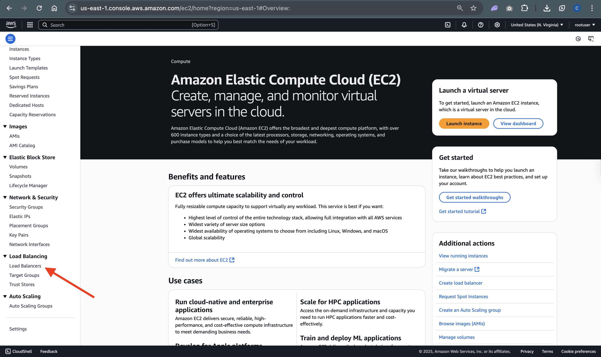

# Deploy a Web Application to Amazon ECS with EC2, Docker, ECR, Load balancer.

## This is a beginner friendly Project you can add to your portfolio.

## RESOURCES COVERED

- EC2
- DOCKER
- ECR
- ECS
- FARGATE
- APPLICATION LOAD BALANCER

## FLOW EXECUTION

### STEP 1

- Launch EC2 Instance
- Install Docker
- Create a directory (`mkdir __project__`)
- Move inside the directory (`cd project`)
- Create index.html and Dockerfile inside project directory using vim or touch command

```bash
vim index.html
touch index.html # Create Blank File
# Reccomendate way to use vim to open an editor to write the content.
```

```bash
vim Dockerfile
touch Dockerfile # Create Blank File
# Reccomendate way to use vim to open an editor to write the content.
```

```ruby
# Dockerfile Content
# Use the official CentOS 7 base image
FROM centos:centos7

# Install the Apache HTTP server package from the CentOS repository
RUN yum install httpd -y

# Copy the index.html file from the Docker build context to the default Apache document root directory in the container
COPY index.html /var/www/html/

# Specify the command to run when the container starts, which starts the Apache HTTP server in the foreground
CMD ["/usr/sbin/httpd","-D","FOREGROUND"]

# Expose port 80 to allow incoming HTTP traffic to the container
EXPOSE 80
```

```html
# Index.html content
<!DOCTYPE html>
<html>
  <head>
    <title>Application Deployment to Amazon ECS</title>
    <style>
      body {
        background-color: seaGreen;
        margin: 0;
        padding: 0;
      }
      .navbar {
        background-color: white;
        display: flex;
        justify-content: space-between;
        align-items: center;
        height: 50px;
        padding: 0 20px;
      }
      .navbar button {
        border: none;
        background-color: white;
        color: orange;
        font-size: 16px;
        font-weight: bold;
        cursor: pointer;
        outline: none;
        padding: 10px 20px;
        margin-right: 10px;
        border-radius: 20px;
        transition: all 0.3s ease;
      }
      .navbar button:hover {
        background-color: seaGreen;
        color: white;
      }
    </style>
  </head>
  <body>
    <div class="navbar">
      <button>Home</button>
      <button>Services</button>
      <button>About Us</button>
      <button>DevOps Courses</button>
    </div>
    <h1>WEB APPLICATION DEPLOYMENT TO ECS TUTORIAL BY RAJEEV</h1>
    <p>
      Feels good learning Containerization with Docker and Deployment to Amazon
      ECS
    </p>
  </body>
</html>
```

- Build Docke Image

```bash
docker build -t project-image .
```

- Run Container

```bash
docker run -d -p 80:80 --name project-container  project-image
```

- Verify whether container is running or not

```bash
docker ps
# Or
docker ps -a

```

Then Copy the paste the ec2-server in your favourite browser search box and you should see the output of index.html

### STEP 2

- Creating ECR
- Login to ECR
- Tag existing image as AWS ECR repo
- Push image into ECR

### STEP 3

Creating Application Load Balancer

### STEP 4

- Create Task Definition
- Create AWS Cluster
- Create Service

### STEP 5

Validation

---

# STEP 1

## Launch an EC2 Instance and install Docker

- Name instance as **ec2-server**
- Select Amazon Linux (Application and Os image)
- Instance Type: t2.micro
- Select **Key pair** if exixt or else create a new one
- Name security group **ec2-server-sg**
  - Allow Permissions
    - ssh(type), 22(port), Anywhere(Source Type)
    - http(type),80 (port) ,Anywhere(Source Type)
- Configure Storage : leave default value (8GiB, gp3)

## SSH into the instance

- Copy Public IP adderes
- Run below command in your local system terminal

```sh
ssh -i <your-key-pair> ec2-user@<ec2-server-public-ip>

sudo su
# To become root user
```

### Update Package Manager

```bash
yum update -y
```

### Install the most recent Docker Community Edition package.

- For Amazon Linux 2, run the following:

```bash
sudo amazon-linux-extras install docker
```

- For Amazon Linux 2023, run the following:

```bash
sudo yum install -y docker
```

### Start the Docker service.

```bash
sudo service docker start
```

### Add the ec2-user to the docker group so that you can run Docker commands without using sudo.

```bash
sudo usermod -a -G docker ec2-user
```

- Pick up the new docker group permissions by logging out and logging back in again. To do this, close your current SSH terminal window and reconnect to your instance in a new one. Your new SSH session should have the appropriate docker group permissions.
- Verify that the ec2-user can run Docker commands without using sudo.

```bash
docker --version
docker ps
```

> Resource Link Of Docker Installation: https://docs.aws.amazon.com/serverless-application-model/latest/developerguide/install-docker.html

# STEP 2

## `STEP 2.1` Creating ECR


- Visibility Stting: Keep **Private**(Selected by default)
- Give a **_Repository name_**: `myecr-repo`
- Leave all the other default settings and click on `create repository`
- clik **View Push Commands** to follow the instruction on how we can `log into our repository`, `Build` image, `tag` the image so you can push the image in this repository, and then push the image to your newly created AWS repository.

  1. Retrieve an authentication token and authenticate your Docker client to your registry.
     Use the AWS CLI:

     ```bash

     ```

  2. Build your Docker image using the following command. For information on building a Docker file from scratch, You can skip this step if your image has already been built:

     ```bash
        docker build -t myecr-repo .
     ```

  3. After the build is completed, tag your image so you can push the image to this repository:

     ```bash

     ```

  4. Run the following command to push this image to your newly created AWS repository:

     ```bash

     ```

- Before we can login to our respository from our terminal, we need to create a permission so we need to create a role and attach a permission (`administrative` permission) before login step.

## `STEP 2.1.1`: Let's Create a Role

- `Go to AWS IAM`
- `click on roles`
  
- create role
  
- `Trusted Entity Type` : Default selection(AWS service)
- `Use Case`: Select **EC2** from dropdown menu and then click **Next**.
  
- `Permission Policies`: AdministratorAccess, and then click `Next`.
- `Role Name`: **ecr-role1** and then keep everything default value or selection, click Create `Role`.

Awesome so this role has been created, so this is how create a repository and assign the necessary permission to it.

Now we need to authenticate for login in, tagging,
and pushing our image to ECR.

## `STEP 2.1.2`: Let's create the access key

- `Go to AWS IAM`
- Click `Users`, above the role in IAM dashboard
- Click on Create user button
  
  
  
  
  
  
  
  
  

---

## `STEP 2.1.3`: Now go back to ec2-server terminal and pass below commands to configure aws

```bash
aws configure
# Enter your access and secret access key, leave other entry like default region and default output format blank / pass the required details.
```

# `STEP 2.2` Login to Elastic Container Registry from AWS CLI, (`STEP 2.3`)Tag the Image and (`STEP 2.4`) Push your Image to Amazon ECR

- Go to ECR Repository
- clik **View Push Commands** to follow the instruction on how we can `log into our repository`, `Build` image, `tag` the image so you can push the image in this repository, and then push the image to your newly created AWS repository.

1. Retrieve an authentication token and authenticate your Docker client to your registry.
   Use the AWS CLI:

   ```bash

   ```

2. Build your Docker image using the following command. For information on building a Docker file from scratch, You can skip this step if your image has already been built:

   ```bash
      docker build -t myecr-repo .
   ```

3. After the build is completed, tag your image so you can push the image to this repository:

   ```bash

   ```

4. Run the following command to push this image to your newly created AWS repository:

   ```bash

   ```

# `STEP 3`: CREATING A APPLICATION LOAD BALANCER

1. Click on Load Balancer
   
2. Select Application Load Balancer
   
3. Give Load Balancer Name and select AZs
   
4. Select ec2-server-SG Security Group, Create target group,
   
   
5. Post Creating Target Group, Select and then click on Create Load Balancer Button.

---

# STEP 4:

## Create Task Definition, Cluster and Service in Amazon ECS | Using Load Balancer in ECS & Validation

1. Go to AMAZON ELASTIC CONTAINER SERVICE
   
2. Click on `Get Started` and slect `Task Definition`
   

- Create new Task Definition
  - `Task Definition`: Blueprint that describe how a Docker container should launch
- Task Definition Family:
  - give a name : ecr-task-def
- `Container 1`
  - `Container Details`:
    - Name: ecs-container
    - Image URI: <Get your from ECR repository>
  - `Port Mapping`
    - `Container Port`: 80, `Protocol`: TCP
    - `Port Name`: ecs-container-1-80-tcp, `App Protocol`: HTTP
- Click `Next`
- `Environment`
  - `App Environment` : AWS Fargate(Serverless)
  - `Operating System/Architecture`: Linux/86_64
  - `Task Size`:
    - `CPU`: 1 vCPU
    - `Memory`: 3GB
- `Task Role, Network Mode- conditional`:
  - `Task Role`: None
  - `Task Execution Role`: Create a task Defenition Role
    - `Go to IAM`
    - `Click on Role`
    - `Create Role`
      - `Trustes Entity Type`: AWS Service
      - `Use Case`: Elastic Container Service (select from drop down men)
        - Select `Elastic Container Service Task`
      - Click `Next`
      - `Permission Policies`: AmazonECSTaskExecutionPolicy
      - Click `Next`
      - `Role Name`: ECSTaskExecution-Role
      - `Description`: Allow ECS tasks to call AWS service on your behalf.
      - Click on `Create Role`
  - Select `task executio role` : ECSTaskExecution-Role (just now created)
- Leave rest as default and click on `Next`
- Review and click on `create`.

### Now we have to create ECS Cluster

ECS cluster is not involved a logical grouping of tasks or services so your task and services are run on infrastructure that are registered to a cluster so all I need to do now, click on:

- `Create Cluster`
- `Cluster Name`: ecs-cluster
- Networking:
  - Remove all subnets except us-east-1a, us-east-1b, and us-east-1c
- Click on `create`.

Awesome, It has created successfully so the next thing we'll be creating is a service in ECS.

- Click on `ecs-cluster`
  
- Click on `Create`
  
  
- Select a task defenition family, Revision should be `1(LATEST)`
  
- Give a service name: ecs-service
  
- Desired Task: 2
  
- Expand the Networking and remove all subnets except inside us-east-1a, us-east-1b, us-east-1c AZs.
  
- Security Group
  - Select create new security group
    - Security Group Name: My-ecs-SG, Description: My-ecs-SG
      
- Expand Load Balancing - Optional

  - Select `Application Load Balancer `from drop down menu
    
  - Choose, Use an existing Load Balancer and select your LB from dropdown menu.
    
  - Use an existing lister : 80:HTTP
    
  - Create New Target group and give a name `service-TG` ,`path pattern`: /\* , `Evolution Order` :1
    

- click on `create` button.

---


## Under Networking inside service we get DNS name, so copy and paste in your favourite browser to access the web app through LB.


